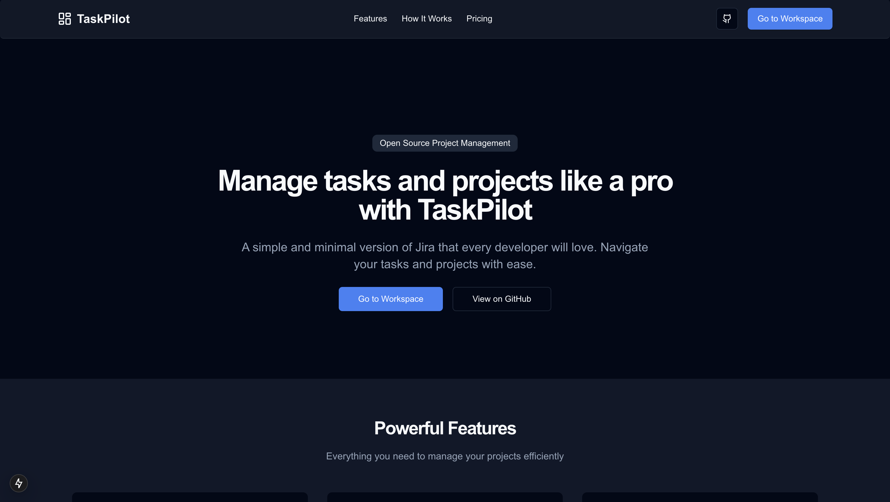
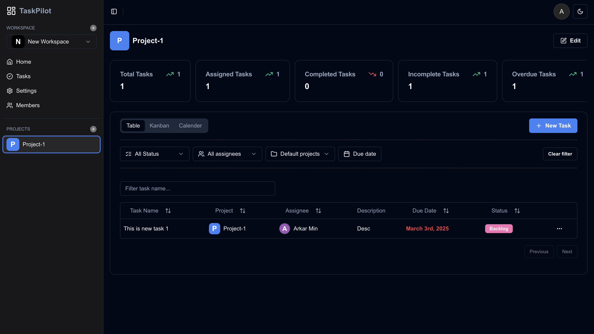
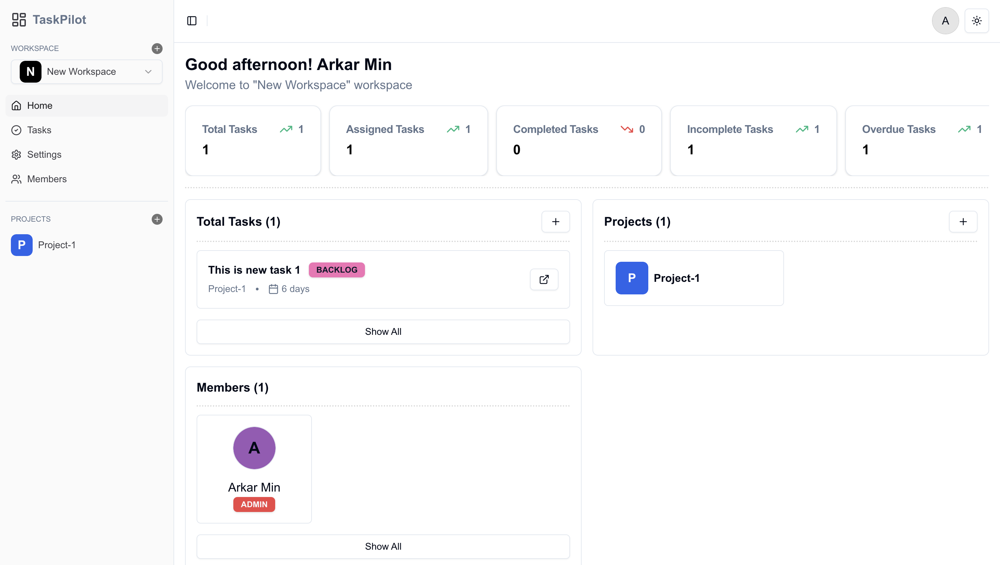

# Task Pilot

Manage, gather and navigate your tasks and projects like a pro with **TaskPilot**. Simple and minimal version of **Jira** but every developer favorite thing, it's Open-Source. Creating workspaces, project, tasks, kanban boards, calendars, invite system, image uploads, analytics, authentication and more other features...

Try Live **TaskPilot** 🌎 : [TaskPilot](https://task-pilot-nine.vercel.app/)

## Tech Stack

- **Frontend**: NextJS 15, TailwindCSS, Shadcn UI
- **Backend**: HonoJS (Hono Trpc), App Write
